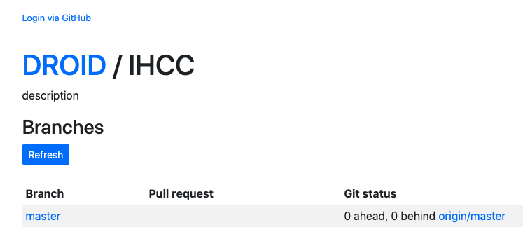
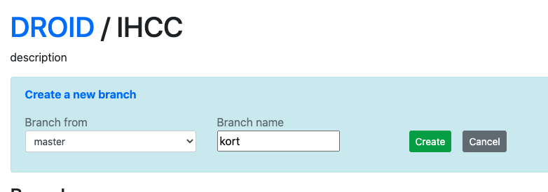
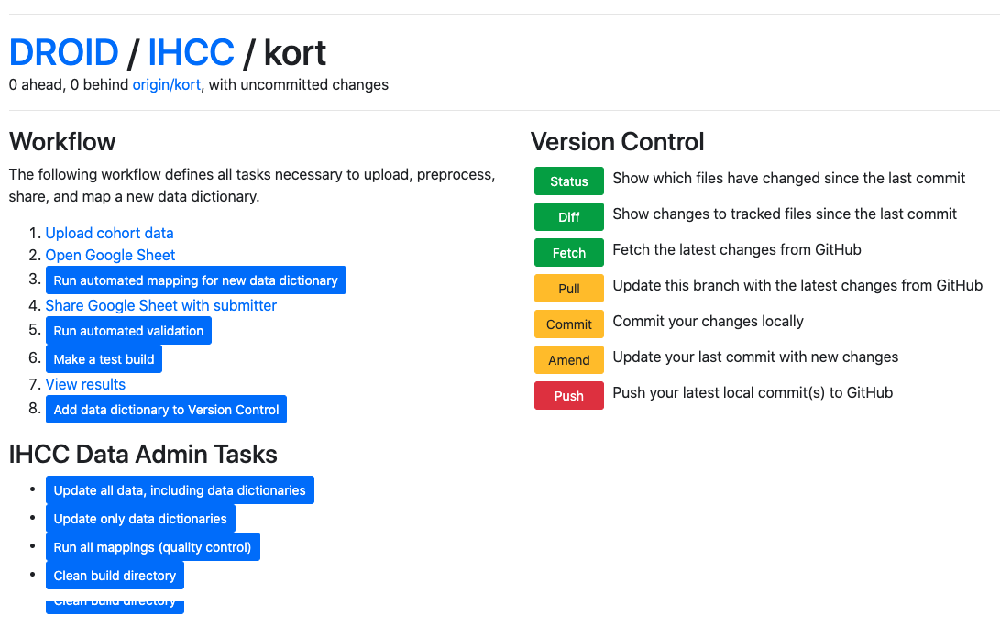
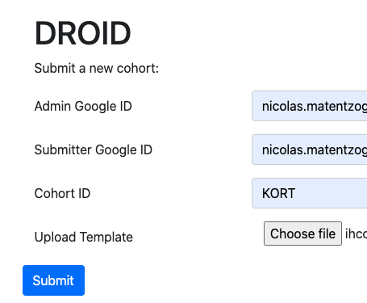

# Instructions for the IHCC Data Steward

The data stewards has three main responsibilities:

1. Working with the data dictionary maintainer to incorporate a new data dictionary
2. Ensuring the quality and consistency of existing mappings over time
3. Updating data dictionary in response to changes to the schema or the data dictionaries themselves

## Incorporating a new data dictionary

1. Go to https://droid.ontodev.com/IHCC.
2. Make sure you are logged in. If you are, you will see your name in the top left corner; if you are not, you will see the Login via GitHub link like this:

3. If you were redirected to the "Available Projects" Overview, click on the [IHCC](https://droid.ontodev.com/IHCC) project.
4. In the IHCC `Branches` overview, click "Refresh", and then do one of the following two options:
   - If you want to continue working on a data dictionary you have previously created, click on the `Checkout` button next to it.
   - If you want to create a new data dictionary, click "Create new". Then, in the `Branch from` window select `master`, and then enter a `Branch name`, ideally corresponding to the name of the data dictionary. Then click `Create`. Here in example where we are creating the fictional data dictionary `KORT`:

6. In the branches view, you will see your new branch along with a red `Delete` button next to it. This means that the branch is available and ready to be viewed. Click on the name of the branch (in the running example, that is `kort`). This will bring you to the IHCC branch control page, which will look something like that:

7. Click on `Upload cohort data`, the first step in the IHCC Data Workflow.
8. Fill in the form that is popping up in a new Window. The filled in form should look something like this:

9. Click `Submit`. Once the upload is complete, you will see a page with two links (`Open Google Sheet` and `Back`). We will close this for now, to go back to the branch control page with the workflow.
10. At this point, it makes sense to look at the Google sheet once to catch obvious errors (bad looking labels, incomplete dictionary etc). There is a fair bit of quality control running, but it makes sense to err on the cautious side.
11. Next, click on `Run automated mapping for new data dictionary`. This will trigger the automated mapping process. In the console below, you will see the progress of the mapping. When the process is finished, the data dictionary will have been uploaded along with the mapping suggestions into. After refreshing a few times, you will hopefully see a Green confirmation pronouncing `Success`. Else, you will have to read the log file and look out for [typical errors](TypicalDataDictionaryBuildErrors.md)
12. You can now share the data dictionary with the submitter by clicking `Share Google Sheet with submitter`.
13. When you receive word from the data dictionary maintainer that they have finished their mappings, you can `Run automated validation`. If everything is correct, you should, after a while, see the green `Success` message. Watch out: `Success` does not mean that there are no errors! It only means that the validation process ran successfully. Read the short log file for potential problems, and communicate them back to the data dictionary providers. DROID will have added validation errors into the Google sheet itself, so they can be fixed by the data dictionary maintainers.

Notes to incorporate:
- You can upload only once - after that, the upload cohort data button redirects to the open google sheet action
- GitHub user handle should be submitted alongside data submission
- Wait for changes to be saved in google sheets before running droid
- Lower case for branch name
- When should I start to panic when the process takes very long? Add to docs
- Add note on the meaning of “delete”
- Add SOP for updating a data dictionary should that become important
- Ad-blocker problem
